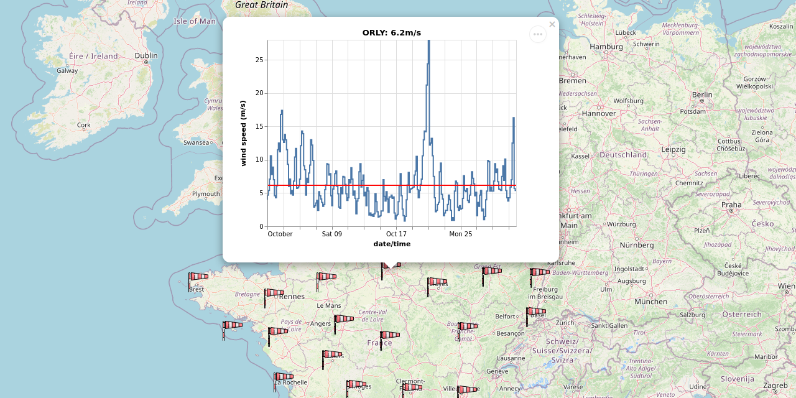

# Visualization using Folium and Altair

An exercise in creating an interactive map using [Folium](https://python-visualization.github.io/folium/) and [Altair](https://altair-viz.github.io) using wind speed data from [Météo-France](https://meteofrance.fr/) plotting latest and archived observations. Generates a HTML page with an interactive `leaflet.js` map and `Vega-Lite` line charts linked to the location of each weather observation station.

## Data

- GeoJSON data for surface weather observation stations `postesSynop.json`
- [SYNOP](https://en.wikipedia.org/wiki/SYNOP) data for latest 3 hour observation period `synop.2022102512.csv`
- SYNOP archived data covering monthly period `synop.202110.csv`

Uses latest observations recorded at 12:00 on 25 Oct 2022 and archived observations from October 2021. [Public data from Météo-France](https://donneespubliques.meteofrance.fr/) is made available through the French government's [Etalab license](https://www.etalab.gouv.fr/licence-ouverte-open-licence/) and the schema for SYNOP data is online [here](https://donneespubliques.meteofrance.fr/client/document/parametres-inclus-dans-les-fichiers-de-donnees-synop_283.pdf).

Windsock icon courtesy of [Flaticon](https://www.flaticon.com/).